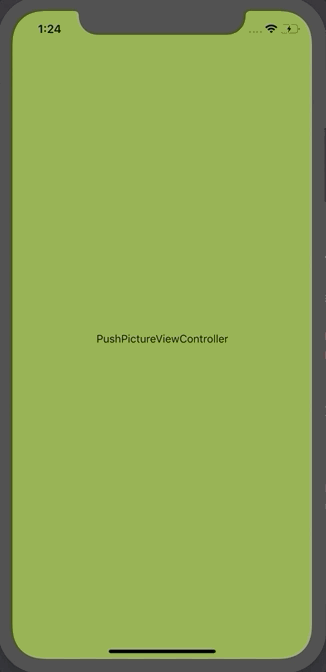

# PictureInPictureVC
A UiViewController class with feature of minimise and maximise, just like the picture in picture mode in AVPlayerViewController in iOS.



# Feartures
- Minimize/Maximize and close button overlays on viewController (automatically hides after 2.5 secs)
- After minimizing,the viewController can be moved around the screen using gestures
- Don't worry 😉, when minimized, the view controller's instance is still in memory, so the state of the
view controller will remain same, even after maximizing it again.

# Usage
- Create your viewController using storyboard or programatically.
- Inherit the `PictureViewController`
```swift
class yourViewController:PictureViewController{
  override func viewDidLoad(){
    super.viewDidLoad()
  }
}
```
- Always push the PictureViewController inherited vc
```swift
 self.navigationController?.pushViewController(yourViewController,animated:true)
 ```
- Thats it you can now minimize and maximize this controller

# Customization
- Can customize control buttons
```swift
 // Minimize button
 self.customizeMinimizeButton(with title:String?,and image:UIImage?)
 // Maximize button
 self.customizeMaximizeButton(with title:String?,and image:UIImage?)
 // Close button
 self.customizeCloseButton(with title:String?,and image:UIImage?)
 ```
- useful properties
```swift
 // override this property, if you want to navigate to root controller on minimize.
 open var popToRootController:Bool{
     return false
 }
 // hides navigation bar on minimizing
 open var hidesNavigationOnMinimize:Bool{
     return false
 }
```
 # LICENSE
 MIT

Feel free to fork and add pull requests for any new features.
